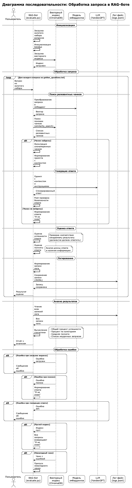

# Задание 7: Аналитика покрытия и качества базы знаний

Это задание реализует систему оценки полноты и актуальности базы знаний, выявления пробелов и анализа качества ответов RAG-бота.

## Структура проекта

```
task_7/
├── create_gaps.py          # Скрипт для создания искусственных пробелов в базе знаний
├── restore_gaps.py         # Скрипт для восстановления удалённых файлов
├── golden_questions.txt     # Золотой набор вопросов для тестирования
├── evaluate.py             # Скрипт автоматического тестирования и оценки
├── sequence.puml           # Диаграмма последовательности обработки запроса
├── sequence.png            # Изображение диаграммы
├── requirements.txt        # Зависимости Python
├── README.md               # Документация (этот файл)
├── logs.jsonl              # Лог запросов (создаётся автоматически)
└── backup_removed_files/   # Резервные копии удалённых файлов
```

## Что было сделано

### 1. Создание искусственных пробелов

Удалены 3 ключевые сущности из базы знаний:
- **Zara Morningstar** (`39_Charlie_Morningstar.md`) — главный персонаж
- **Korax** (`88_Alastor.md`) — важный персонаж
- **Twilight Manor** (`138_Hazbin_Hotel.md`) — ключевая локация

**Использование:**
```bash
# Создать пробелы (удалить файлы)
python create_gaps.py

# Восстановить файлы после тестирования
python restore_gaps.py
```

### 2. Система логирования запросов

Реализовано логирование всех запросов к боту в формате JSONL (`logs.jsonl`).

**Поля лога:**
- `timestamp` — время запроса
- `query` — текст запроса
- `chunks_found` — количество найденных чанков
- `answer_length` — длина ответа в символах
- `is_successful` — флаг успешности ответа
- `completeness_score` — оценка полноты ответа (0.0-1.0)
- `should_answer` — должен ли бот ответить на этот вопрос
- `sources` — список источников (файлов)
- `answer` — полный текст ответа
- `filtered_chunks` — количество отфильтрованных чанков
- `input_tokens`, `output_tokens`, `total_tokens` — статистика использования токенов

### 3. Золотой набор вопросов

Создан файл `golden_questions.txt` с 15 вопросами:
- **8 вопросов на известные темы** — бот должен ответить
- **7 вопросов на удалённые/отсутствующие темы** — бот должен сказать "Я не знаю"

### 4. Автоматическое тестирование

Скрипт `evaluate.py` автоматически:
1. Загружает золотой набор вопросов
2. Задаёт каждый вопрос боту
3. Оценивает качество ответа
4. Сохраняет результаты в лог
5. Анализирует статистику и выявляет пробелы

**Использование:**
```bash
# Запустить тестирование
python evaluate.py
```

**Оценка качества:**
- **Успешность ответа**: проверяет, соответствует ли ответ ожидаемому результату
- **Полнота ответа**: оценивает длину и информативность ответа (0.0-1.0)

### 5. Диаграмма последовательности

Создана диаграмма в формате PlantUML (`sequence.puml`), показывающая:
- Процесс обработки запроса
- Взаимодействие компонентов системы
- Обработку ошибок
- Процесс оценки и логирования



**Просмотр диаграммы:**
1. Откройте изображение `sequence.png` (сгенерировано из `sequence.puml`)
2. Или откройте `sequence.puml` в онлайн-редакторе PlantUML: http://www.plantuml.com/plantuml/uml/
3. Или используйте расширение PlantUML в VS Code/IntelliJ IDEA

## Результаты анализа

После запуска `evaluate.py` вы получите:

### Статистика
- Общий процент успешности ответов
- Процент успешности по категориям (должен ответить / должен не ответить)
- Средняя оценка полноты ответов

### Выявленные пробелы
- Список вопросов, на которые бот не ответил корректно
- Темы, по которым база знаний неполная

### Рекомендации
На основе анализа логов можно:
1. Выявить темы, требующие расширения базы знаний
2. Определить, где бот выдаёт нерелевантные источники
3. Найти вопросы, на которые бот часто не отвечает

## Пример использования

```bash
# 1. Создать пробелы в базе знаний
cd task_7
python create_gaps.py

# 2. Запустить тестирование
python evaluate.py

# 3. Просмотреть результаты
cat logs.jsonl | jq '.'

# 4. Восстановить файлы после тестирования
python restore_gaps.py
```

## Формат лога (JSONL)

Каждая строка в `logs.jsonl` — это JSON-объект:

```json
{
  "timestamp": "2025-01-17T10:30:00",
  "query": "Кто такая Zara Morningstar?",
  "chunks_found": 0,
  "answer_length": 45,
  "is_successful": true,
  "completeness_score": 0.0,
  "should_answer": false,
  "sources": [],
  "answer": "Я не знаю. В базе знаний не найдено информации по вашему запросу.",
  "filtered_chunks": 0,
  "input_tokens": 150,
  "output_tokens": 20,
  "total_tokens": 170
}
```

## Анализ результатов

После тестирования можно проанализировать логи:

```python
import json

# Читаем логи
logs = []
with open("logs.jsonl", "r") as f:
    for line in f:
        logs.append(json.loads(line))

# Анализируем неудачные запросы
failed = [log for log in logs if not log["is_successful"]]
print(f"Неудачных запросов: {len(failed)}")
for log in failed:
    print(f"  - {log['query']}")
```

## Выводы

Система позволяет:
- ✅ Систематически оценивать качество базы знаний
- ✅ Выявлять пробелы в покрытии тем
- ✅ Отслеживать изменения качества со временем
- ✅ Принимать обоснованные решения по улучшению базы знаний

## Зависимости

Все зависимости указаны в `requirements.txt`. Для установки:

```bash
pip install -r requirements.txt
```

## Примечания

- Перед тестированием убедитесь, что векторный индекс создан (`task_3/build_index.py`)
- После создания пробелов нужно пересоздать индекс или использовать инкрементальное обновление
- Для восстановления файлов используйте `restore_gaps.py`

